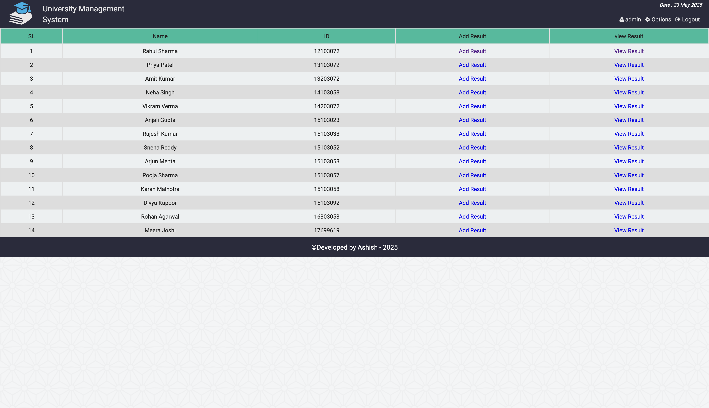

# University Management System

This project is a University Management System with three user panels: Admin, Faculty, and Student. The system is built using PHP, HTML, CSS, JavaScript, and MySQL.

## Features

### 1. Admin Panel
- **Manage Students**: Add, remove, modify student details, and update passwords if forgotten.
- **Manage Teachers**: Add, remove, modify teacher details, and update passwords if forgotten.
- **Course Management**: Add courses for students and teachers.
- **Fee Management**: Add fees for students.
- **Settings**: Update the current semester of the university.

### 2. Teacher Panel
- **Manage Results**: Add results for students as given by authority or admin.
- **Password Management**: Change password.
- **GPA Calculations**: Calculate SGPA and CGPA.
- **Profile**: View and update profile details.

### 3. Student Panel
- **Course Management**: Show registered courses.
- **Results**: View results.
- **Fee Management**: View fee details.
- **Profile**: View and update profile details.
- **Password Management**: Update password.

## Getting Started

### Prerequisites
- PHP
- MySQL
- Web Server (e.g., Apache)
- Web Browser

### Installation
1. **Clone the repository**
    
bash
   - git clone https://github.com/ashishnanda19/ums-project.git
   - cd ums-project.git

2. **Import the Database**
    - Create a database named ums.
    - Import the ums.sql file located in the database directory into your MySQL database.

3. **Configure Database**
    - Update the database configuration in config.php with your MySQL credentials:
    

**php**
        $sName   = "localhost";
        $uName   = "root";
        $pass    = "";
        $db_name = "ums";

4. **Start the Web Server**
    - Ensure your web server is running and place the project files in the server's root directory (e.g., htdocs for XAMPP).

5. **Access the Application**
    - Open your web browser and navigate to http://localhost/ums-project.

## Login Details

### Admin
- **Username**: admin
- **Password**: 123

### Faculty
- **Username**: faculty
- **Password**: 123.

### Student
- Create New Account for Student.

## Technologies Used
- **Backend**: PHP
- **Frontend**: HTML, CSS, JavaScript
- **Database**: MySQL

## 📸 Screenshots

### 1. Admin Panel

### 2. Student Registration Page

### 3. Student Details Page

### 4. Attendance Management

### 5. Result Page

